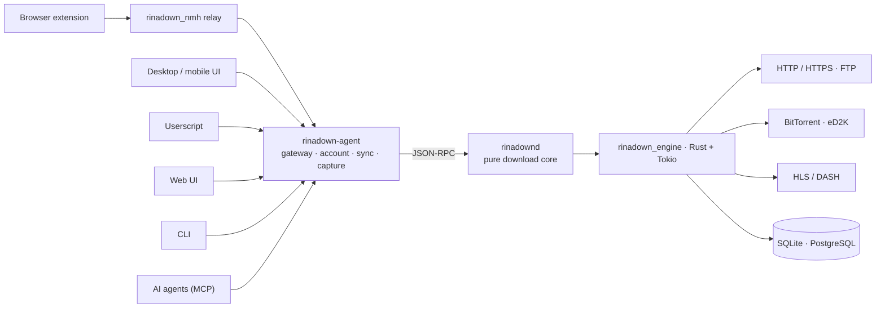

<div align="center">


# RinaDown

### Downloads, Supercharged.

*A blazing fast, multi-protocol download manager — the free & open-source IDM alternative.*

[](../../releases/latest)
[](LICENSE)
[](#installation)
[](native/engine)
[](lib)
[](crates/app)
[](native/api)

[](https://github.com/rust-unofficial/awesome-rust#utilities)
[](https://github.com/thechampagne/awesome-windows#utilities)
[](https://github.com/Axorax/awesome-free-apps#download-managers)
[](https://github.com/offa/android-foss#-downloader--manager)
[](https://github.com/pcqpcq/open-source-android-apps/blob/master/categories/tools.md)
[](https://portainer-templates.as93.net/rinadown)
[](https://github.com/selfhosters/unRAID-CA-templates/blob/master/templates/rinadown.xml)
[](https://github.com/1c7/chinese-independent-developer)

[**Website**](https://rinadown.zerx.dev) · [**Download**](https://rinadown.zerx.dev/#download) · [**Docs**](https://rinadown.zerx.dev/docs/) · [**Changelog**](https://rinadown.zerx.dev/changelog) · [**FAQ**](https://rinadown.zerx.dev/faq) · [**Feedback**](https://rinadown.zerx.dev/feedback)

**English** | [简体中文](README.zh-CN.md)

</div>

---

## Highlights

- **Up to 10x faster** — a from-scratch Rust + Tokio engine with IDM-style *dynamic* segmentation
- **Multi-protocol** — HTTP/HTTPS, FTP, BitTorrent (DHT / UPnP / magnet), eD2K, HLS & DASH streaming
- **One engine, many hosts** — the same `rinadown_engine` drives the desktop app, the Android app, a headless NAS server and a CLI
- **Browser integration** — Chrome / Edge / Firefox extension with a 3-layer interception engine, plus a userscript and a native-messaging relay
- **AI-agent ready** — built-in MCP (Model Context Protocol) server with 12 tools, alongside a REST API and an aria2-compatible JSON-RPC endpoint
- **Resume anywhere** — every byte persisted in SQLite (WAL); crashes, power loss and reboots never cost you progress
- **Extensible** — sandboxed JavaScript plugins with a decentralized market, plus managed ffmpeg / yt-dlp components
- **Beautiful UI** — light/dark themes, 13 character accent colors + custom, responsive three-pane layout
- **Clean & private** — free and open source, no ads, no tracking, no account required, local-first

## Features

| Feature | Description |
|---|---|
| **Rust-Powered Engine** | Built on Rust and Tokio with zero-cost abstractions — memory-safe concurrency at maximum throughput |
| **Dynamic Segmentation** | Segments split at runtime and idle connections rescue slow segments, just like IDM — but self-tuning |
| **Multi-Protocol** | Dedicated engines for HTTP/HTTPS, FTP, BitTorrent (DHT/UPnP/magnet), eD2K (server + Kad DHT source finding, MD4 verification), HLS (AES-decrypt) and DASH |
| **Speed Control** | Token-bucket global rate limiting plus per-queue limits — download in the background without killing your browsing |
| **Resume Anywhere** | Every byte tracked in SQLite with WAL (PostgreSQL is supported for the headless server); power loss never costs you progress |
| **Queues, Groups & Categories** | Named queues with their own concurrency, speed limit and target directory; task groups for batch operations; auto-organized category folders |
| **Headless & Remote** | `rinadownd` runs standalone on a NAS or VPS and is driven over a versioned local JSON-RPC protocol — the desktop app is an optional client, not a requirement |
| **Open Interfaces** | REST management API, MCP server and aria2-compatible JSON-RPC serve every client: CLI, web UI, browser extension, userscript and your own scripts |
| **Plugin System** | Sandboxed JavaScript plugins turn pages and playlists into real download sources; a Git-indexed market keeps plugin discovery decentralized |
| **RSS & Automation** | Scheduled RSS polling creates tasks unattended, with per-feed filters, queues and destination directories |
| **Webhooks** | Task lifecycle events pushed to your own HTTP endpoints, so RinaDown can trigger anything downstream |
| **Browser Integration** | Three-layer download interception, streaming media sniffing, Alt+Click bypass, right-click send |
| **Beautiful Interface** | shadcn-style widgets, IDM-style segment visualization, named queues, system tray |
| **Clean & Private** | Zero ads, zero telemetry lock-in, zero accounts — your data stays on your machine |

## RinaDown vs. IDM

| | RinaDown | IDM |
|---|:---:|:---:|
| Price | **Free & open source** | $24.95 + renewals |
| Open source | Yes (AGPL-3.0) | No |
| Platforms | Windows / macOS / Linux / NAS / Android | Windows only |
| BitTorrent & magnet | Yes | No |
| eD2K / eMule links | Yes | No |
| HLS / DASH streaming | Yes | Partial |
| Dynamic segmentation | Yes | Yes |
| Browser extension | Chrome / Edge / Firefox | Yes |
| Ads & tracking | **None** | — |

## Installation

Grab the latest build from [**rinadown.zerx.dev**](https://rinadown.zerx.dev/#download) or from the [**latest release**](../../releases/latest) of this repository:

| Platform | Packages |
|---|---|
| **Windows** (x64 / ARM64) | `setup.exe` installer · portable `.zip` |
| **macOS** (Intel / Apple Silicon) | `.dmg` · portable `.tar.gz` |
| **Linux** (x64) | `.AppImage` · `.deb` · Arch `.pkg.tar.zst` · portable `.tar.gz` |
| **Android** (arm64-v8a / armeabi-v7a / x86_64) | per-ABI `.apk` · universal `.apk` |
| **NAS / Server** (headless, x64 / ARM64) | Docker image (GHCR) · Synology DSM 6/7 `.spk` · QNAP `.qpkg` · OpenWrt `.ipk` · Unraid CA template · CasaOS / ZimaOS app store — see the [server docs](https://rinadown.zerx.dev/docs/) |

### Browser Extension

Install the extension so RinaDown takes over browser downloads automatically:

[](https://chromewebstore.google.com/detail/rinadown/meleenglfggcmcajknpeeeiobnpfmahc)
[](https://microsoftedge.microsoft.com/addons/detail/rinadown/nglkkjbogjghekbhhcnccnpfedjbdhhd)
[](https://addons.mozilla.org/firefox/addon/rinadown)

## MCP Server (Model Context Protocol)

RinaDown ships a built-in **MCP server** so AI agents (Claude Desktop, Cursor, Cline, …) can manage downloads via the [Model Context Protocol](https://modelcontextprotocol.io). It speaks **Streamable HTTP** (JSON-RPC 2.0 over a single `POST /mcp`) on the local API port — no extra process needed.

- **Endpoint**: `http://127.0.0.1:17800/mcp` (local-only by default)
- **Auth**: Bearer token (`Authorization: Bearer <token>` or `X-RinaDown-Token`), shared with the management API
- **Enable**: Settings → API Service → toggle *MCP endpoint* (a token is generated automatically); the headless server enables it by default

### Tools (12)

| Tool | Description |
|---|---|
| `download_add` | Create a download task (HTTP/HTTPS, FTP, magnet, BitTorrent) |
| `download_list` | List tasks with progress/speed/status, optional status filter |
| `download_get` | Get a single task by ID |
| `download_pause` / `download_resume` | Pause / resume one task |
| `download_pause_all` / `download_resume_all` | Pause / resume all tasks |
| `download_remove` | Remove a task, optionally deleting downloaded files |
| `queue_list` | List named queues and their configuration |
| `rss_list` | List RSS subscriptions with their configuration and runtime state |
| `rss_add` | Subscribe to an RSS feed and start polling it on a schedule |
| `rss_remove` | Delete an RSS subscription and the items it collected |

### Client configuration

```json
{
  "mcpServers": {
    "rinadown": {
      "url": "http://127.0.0.1:17800/mcp",
      "headers": { "Authorization": "Bearer <your-token>" }
    }
  }
}
```

The MCP layer is implemented in [`native/api/src/mcp.rs`](native/api/src/mcp.rs) on top of the same `ApiHost` trait that powers the REST management API and aria2-compatible JSON-RPC.

## Plugins & Components

RinaDown is extensible without patching the core:

- **JavaScript plugins** — sandboxed QuickJS plugins turn a page, playlist or manifest into one or more concrete download sources (HLS quality ladders, site-specific extractors, …). A plugin declares the permissions it needs (`ffmpeg`, `ytdlp`), runs under memory, interrupt and timeout limits, and is circuit-broken after repeated failures instead of taking the app down with it.
- **Decentralized market** — plugins are discovered through a Git-versioned JSON index. Anyone can fork it and point the app at their own index; multiple index sources fail over automatically and every entry is content-addressed (`sha256` of the archive).
- **Managed components** — ffmpeg and yt-dlp are installed, versioned and updated as first-class managed components, which is what powers video parsing and stream muxing.

Plugin support is feature-gated (`plugins`, `components`) and compiled out of mobile and CLI builds — with the gate closed, the download path is unchanged.

## Architecture

**One engine, many hosts, many clients.** Every download lives in [`rinadown_engine`](native/engine) — a Rust crate with no FFI, UI or HTTP dependencies — and talks to the outside world through exactly three traits:

| Trait | Direction | Responsibility |
|---|---|---|
| `EventSink` | engine → host | progress, segment splits, queue and group changes |
| `HostSelection` | engine → host | asks the host to decide: HLS quality, BitTorrent file selection, plugin variant |
| `ApiHost` | client → engine | the capability surface behind the REST / MCP / aria2 endpoints |

The API layer only ever sees `&dyn ApiHost`, so a single HTTP surface serves every host. The PC desktop additionally ships a three-process local chain — `rinadown-desktop` → `rinadown-agent` → `rinadownd` — where `rinadownd` is a pure download core owning tasks, queues, RSS and plugins, and `rinadown-agent` is the UI gateway owning accounts, cloud sync, device pairing and the browser-capture endpoint. The two speak the versioned JSON-RPC protocol defined in [`native/protocol/`](native/protocol).



| Layer | Tech | Path |
|---|---|---|
| Download engine | Rust + Tokio, zero FFI / UI deps | [`native/engine/`](native/engine) |
| Download core (`rinadownd`) | tasks, queues, groups, RSS, plugins, webhooks | [`native/daemon/`](native/daemon) |
| UI gateway (`rinadown-agent`) | accounts, cloud sync, remote tasks, browser capture | [`native/agent/`](native/agent) |
| Local protocol | versioned JSON-RPC wire types | [`native/protocol/`](native/protocol) |
| HTTP surface | REST · MCP · aria2-compatible JSON-RPC | [`native/api/`](native/api) |
| Desktop shell | GPUI (Rust-native) | [`crates/app/`](crates/app) |
| Flutter app | Flutter + shadcn_ui over Rinf signals | [`lib/`](lib) · [`native/hub/`](native/hub) |
| Headless server | standalone HTTP host with the Web UI embedded | [`native/server/`](native/server) |
| Browser extension | WXT + TypeScript | [`rinaDown/`](rinaDown) |
| Userscript | Tampermonkey-compatible | [`userscript/`](userscript) |
| Web UI | React SPA (Vite), compiled into the server binary | [`web/`](web) |
| Website & docs | Astro + React | [`website/`](website) |

## Building from Source

**Prerequisites**: [Flutter SDK](https://docs.flutter.dev/get-started/install) · [Rust toolchain](https://www.rust-lang.org/tools/install) · [Rinf CLI](https://rinf.cunarist.org)

```shell
# Clone the development branch (main = active development, stable = stable releases)
git clone -b main <this-repository-url> RinaDown
cd RinaDown

# Check your environment
rustc --version
flutter doctor

# Install the Rinf CLI (once)
cargo install rinf_cli

# Fetch dependencies & generate Dart bindings
flutter pub get
rinf gen

# Run in debug mode
flutter run

# Build a release
flutter build windows --release   # or: macos / linux

# Build the native desktop chain (GPUI shell + gateway + download core)
cargo build --release -p rinadown_ui_app -p rinadown_agent -p rinadown_daemon
```

<details>
<summary><b>Linux system dependencies</b></summary>

```shell
# Debian/Ubuntu
sudo apt-get install cmake ninja-build clang pkg-config \
  libgtk-3-dev libayatana-appindicator3-dev libnotify-dev libsecret-1-dev patchelf zstd

# Arch Linux
sudo pacman -S cmake ninja clang pkgconf gtk3 libayatana-appindicator libnotify libsecret patchelf zstd
```

The NMH relay binary (`rinadown_nmh`) is built automatically by CMake during `flutter build`. Distribution packages (AppImage / deb / Arch / portable) are produced by [CI](.github/workflows/release.yml) on every tag.

</details>

<details>
<summary><b>Running tests</b></summary>

```shell
flutter test                                  # Dart / Flutter tests
cargo nextest run -p rinadown_engine          # engine: protocols, segmentation, DB
cargo test -p rinadown_api                    # HTTP API: REST, MCP, aria2, OpenAPI drift
cargo test -p rinadown_server                 # headless server
cargo test -p rinadown_cli                    # CLI
```

</details>

## Contributing & Community

- **Bug reports / feature requests** — open an [issue](../../issues) or use the in-app feedback dialog
- **Docs & translations** — the website documentation lives in this repository; every page has an *Edit this page* link
- **QQ Group** — [832143651](https://rinadown.zerx.dev/qq-group)

Pull requests are welcome! Branch off `main` and target `main` — it is the development branch, while `stable` only tracks stable releases (maintainers advance it from `main`). Before submitting, please make sure:

```shell
cargo fmt --check && cargo clippy -- -D warnings   # Rust
flutter analyze                                     # Dart
```

See [CONTRIBUTING.md](CONTRIBUTING.md) for the full workflow.

## Contributors

- **DeepSeek** — AI pair-programming partner: the Rust engine internals, the Flutter / GPUI UI layers, the browser extension and these docs were written in an ongoing collaboration with [DeepSeek](https://www.deepseek.com).
- **Everyone else** — thank you! See the [contributors graph](../../graphs/contributors) for the full list.

## License

Distributed under the [GNU Affero General Public License v3.0](LICENSE).

<div align="center">

**If RinaDown saves you time, consider giving it a Star — it helps more people discover the project.**

</div>
