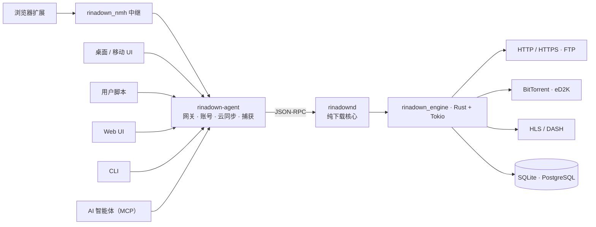

<div align="center">


# RinaDown

### 下载，全面加速。

*极速多协议下载管理器 —— 免费开源的 IDM 替代品。*

[](../../releases/latest)
[](LICENSE)
[](#安装)
[](native/engine)
[](lib)
[](crates/app)
[](native/api)

[](https://github.com/rust-unofficial/awesome-rust#utilities)
[](https://github.com/thechampagne/awesome-windows#utilities)
[](https://github.com/Axorax/awesome-free-apps#download-managers)
[](https://github.com/offa/android-foss#-downloader--manager)
[](https://github.com/pcqpcq/open-source-android-apps/blob/master/categories/tools.md)
[](https://portainer-templates.as93.net/rinadown)
[](https://github.com/selfhosters/unRAID-CA-templates/blob/master/templates/rinadown.xml)
[](https://github.com/1c7/chinese-independent-developer)

[**官网**](https://rinadown.zerx.dev) · [**下载**](https://rinadown.zerx.dev/#download) · [**文档**](https://rinadown.zerx.dev/docs/) · [**更新日志**](https://rinadown.zerx.dev/changelog) · [**常见问题**](https://rinadown.zerx.dev/faq) · [**反馈**](https://rinadown.zerx.dev/feedback)

[English](README.md) | **简体中文**

</div>

---

## 亮点

- **最高 10 倍提速** —— 从零手写的 Rust + Tokio 引擎，IDM 式运行时*动态*分段
- **多协议支持** —— HTTP/HTTPS、FTP、BitTorrent（DHT / UPnP / 磁力）、eD2K、HLS 与 DASH 流媒体
- **一套引擎，多个宿主** —— 同一个 `rinadown_engine` 同时驱动桌面端、Android 端、NAS 无头服务器与 CLI
- **浏览器集成** —— Chrome / Edge / Firefox 扩展（三层下载拦截引擎），另有用户脚本与 Native Messaging 中继
- **AI 智能体就绪** —— 内置 MCP（Model Context Protocol）服务器，12 个工具；同时提供 REST API 与 aria2 兼容 JSON-RPC
- **随处续传** —— 每个字节都持久化到 SQLite（WAL），崩溃、断电、重启都不丢进度
- **可扩展** —— 沙箱化 JavaScript 插件 + 去中心化插件市场，以及受管 ffmpeg / yt-dlp 组件
- **精美界面** —— 深浅主题、13 套角色应援配色 + 自定义、响应式三栏布局
- **干净纯粹** —— 免费开源、零广告、零追踪、无需账号、本地优先

## 功能特性

| 特性 | 说明 |
|---|---|
| **Rust 驱动引擎** | 基于 Rust 与 Tokio 的零开销抽象 —— 内存安全的并发，榨干带宽 |
| **动态分段** | 运行时动态拆分分段，空闲连接接管慢速分段 —— 像 IDM，但会自我调优 |
| **多协议** | HTTP/HTTPS、FTP、BitTorrent（DHT/UPnP/磁力）、eD2K（服务器 + Kad DHT 找源、MD4 校验）、HLS（AES 解密）、DASH 专属引擎 |
| **速度控制** | Token bucket 全局限速，并可对单个队列限速 —— 后台下载不影响正常上网 |
| **随处续传** | 每个字节都记录在 SQLite（WAL 模式；无头服务器支持 PostgreSQL），断电也不丢进度 |
| **队列、分组与分类** | 命名队列各自拥有并发数、限速与目标目录；任务分组便于批量操作；一键归类目录 |
| **无头与远程** | `rinadownd` 可脱离界面独立运行在 NAS 或 VPS 上，通过版本化的本机 JSON-RPC 协议驱动 —— 桌面端仅是可选客户端，而非必需品 |
| **开放接口** | REST 管理 API、MCP 服务器与 aria2 兼容 JSON-RPC 服务所有客户端：CLI、Web UI、浏览器扩展、用户脚本与你自己写的脚本 |
| **插件系统** | 沙箱化 JavaScript 插件把页面与播放列表解析成真实下载源；Git 索引化的插件市场让发现过程保持去中心化 |
| **RSS 与自动化** | 定时轮询 RSS 订阅，配合每条订阅的过滤规则、队列与目标目录，全程无需人工干预 |
| **Webhook** | 任务生命周期事件推送到你自己的 HTTP 端点，交由下游系统处理 |
| **浏览器集成** | 三层下载拦截、流媒体资源嗅探、Alt+Click 绕过、右键发送 |
| **精美界面** | shadcn 风格组件、IDM 式分段可视化、命名队列、系统托盘 |
| **干净纯粹** | 零广告、零追踪、无账号 —— 数据全部留在你的机器上 |

## RinaDown vs. IDM

| | RinaDown | IDM |
|---|:---:|:---:|
| 价格 | **免费开源** | $24.95 + 续费 |
| 开源 | 是（AGPL-3.0） | 否 |
| 平台 | Windows / macOS / Linux / NAS / Android | 仅 Windows |
| BitTorrent 与磁力链 | 支持 | 不支持 |
| eD2K / eMule 链接 | 支持 | 不支持 |
| HLS / DASH 流媒体 | 支持 | 部分支持 |
| 动态分段 | 支持 | 支持 |
| 浏览器扩展 | Chrome / Edge / Firefox | 支持 |
| 广告与追踪 | **无** | — |

## 安装

从 [**rinadown.zerx.dev**](https://rinadown.zerx.dev/#download) 或本仓库的 [**最新 Release**](../../releases/latest) 获取最新版本：

| 平台 | 安装包 |
|---|---|
| **Windows**（x64 / ARM64） | `setup.exe` 安装程序 · 便携版 `.zip` |
| **macOS**（Intel / Apple Silicon） | `.dmg` · 便携版 `.tar.gz` |
| **Linux**（x64） | `.AppImage` · `.deb` · Arch `.pkg.tar.zst` · 便携版 `.tar.gz` |
| **Android**（arm64-v8a / armeabi-v7a / x86_64） | 分架构 `.apk` · 通用 `.apk` |
| **NAS / 服务器**（headless，x64 / ARM64） | Docker 镜像（GHCR） · 群晖 DSM 6/7 `.spk` · QNAP `.qpkg` · OpenWrt `.ipk` · Unraid CA 模板 · CasaOS / ZimaOS 应用商店 —— 详见[服务器文档](https://rinadown.zerx.dev/docs/) |

### 浏览器扩展

安装扩展后，RinaDown 会自动接管浏览器下载：

[](https://chromewebstore.google.com/detail/rinadown/meleenglfggcmcajknpeeeiobnpfmahc)
[](https://microsoftedge.microsoft.com/addons/detail/rinadown/nglkkjbogjghekbhhcnccnpfedjbdhhd)
[](https://addons.mozilla.org/zh-CN/firefox/addon/rinadown)

## MCP 服务器（Model Context Protocol）

RinaDown 内置 **MCP 服务器**，AI 智能体（Claude Desktop、Cursor、Cline 等）可通过 [Model Context Protocol](https://modelcontextprotocol.io) 管理下载。采用 **Streamable HTTP**（单一 `POST /mcp` 上的 JSON-RPC 2.0），复用本机 API 端口，无需额外进程。

- **端点**：`http://127.0.0.1:17800/mcp`（默认仅本机可访问）
- **鉴权**：Bearer token（`Authorization: Bearer <token>` 或 `X-RinaDown-Token`），与管理 API 共用
- **开启方式**：设置 → API 服务 → 打开 *MCP 端点*（自动生成 token）；headless 服务器默认开启

### 工具（12 个）

| 工具 | 说明 |
|---|---|
| `download_add` | 新建下载任务（HTTP/HTTPS、FTP、磁力、BitTorrent） |
| `download_list` | 列出任务（含进度/速度/状态），可按状态过滤 |
| `download_get` | 按 ID 查询单个任务 |
| `download_pause` / `download_resume` | 暂停 / 恢复单个任务 |
| `download_pause_all` / `download_resume_all` | 暂停 / 恢复全部任务 |
| `download_remove` | 删除任务，可选同时删除磁盘文件 |
| `queue_list` | 列出命名队列及其配置 |
| `rss_list` | 列出 RSS 订阅及其配置与运行态 |
| `rss_add` | 新增 RSS 订阅并开始定期抓取 |
| `rss_remove` | 删除 RSS 订阅及其已收集条目 |

### 客户端配置

```json
{
  "mcpServers": {
    "rinadown": {
      "url": "http://127.0.0.1:17800/mcp",
      "headers": { "Authorization": "Bearer <your-token>" }
    }
  }
}
```

MCP 层实现在 [`native/api/src/mcp.rs`](native/api/src/mcp.rs)，与 REST 管理 API、aria2 兼容 JSON-RPC 共用同一个 `ApiHost` trait。

## 插件与组件

RinaDown 无需改动内核即可扩展：

- **JavaScript 插件** —— 沙箱化 QuickJS 插件把一个页面、播放列表或清单解析成一个或多个真实下载源（HLS 画质阶梯、站点专用解析器等）。插件需声明自己用到的权限（`ffmpeg`、`ytdlp`），运行在内存 / 中断 / 超时三重限制下，连续失败会被熔断，而不会拖着整个应用一起崩。
- **去中心化市场** —— 插件通过 Git 版本化的 JSON 索引分发。任何人都可以 fork 一份并让应用指向自己的索引；多个索引源自动 failover，每个条目都按内容寻址（归档包的 `sha256`）。
- **受管组件** —— ffmpeg 与 yt-dlp 作为一等受管组件被安装、版本化与更新，视频解析与流封装全靠它们。

插件能力由 feature 门控（`plugins`、`components`），在移动端与 CLI 构建中直接编译掉 —— 门关着时下载主链路行为不变。

## 架构

**一套引擎、多个宿主、多个客户端。** 所有下载逻辑都在 [`rinadown_engine`](native/engine) 里 —— 一个不依赖 FFI、UI 与 HTTP 的 Rust crate —— 并且只通过三个 trait 与外界交互：

| Trait | 方向 | 职责 |
|---|---|---|
| `EventSink` | 引擎 → 宿主 | 进度、分段拆分、队列与分组变化 |
| `HostSelection` | 引擎 → 宿主 | 请宿主做决策：HLS 画质、BitTorrent 文件选择、插件 variant |
| `ApiHost` | 客户端 → 引擎 | REST / MCP / aria2 端点背后的能力面 |

API 层只见 `&dyn ApiHost`，因此同一套 HTTP 面可以服务任意宿主。PC 桌面端还额外运行一条三进程本机链路 —— `rinadown-desktop` → `rinadown-agent` → `rinadownd`：`rinadownd` 是纯下载核心，持有任务、队列、RSS 与插件；`rinadown-agent` 是 UI 网关，持有账号、云同步、设备协同与浏览器捕获端点。两者通过 [`native/protocol/`](native/protocol) 定义的版本化 JSON-RPC 协议通信。



| 层 | 技术栈 | 目录 |
|---|---|---|
| 下载引擎 | Rust + Tokio，零 FFI / UI 依赖 | [`native/engine/`](native/engine) |
| 下载核心（`rinadownd`） | 任务、队列、分组、RSS、插件、Webhook | [`native/daemon/`](native/daemon) |
| UI 网关（`rinadown-agent`） | 账号、云同步、远程任务、浏览器捕获 | [`native/agent/`](native/agent) |
| 本机协议 | 版本化 JSON-RPC wire 类型 | [`native/protocol/`](native/protocol) |
| HTTP 面 | REST · MCP · aria2 兼容 JSON-RPC | [`native/api/`](native/api) |
| 桌面外壳 | GPUI（Rust 原生） | [`crates/app/`](crates/app) |
| Flutter 应用 | Flutter + shadcn_ui，经 Rinf 信号通信 | [`lib/`](lib) · [`native/hub/`](native/hub) |
| 无头服务器 | 内嵌 Web UI 的独立 HTTP 宿主 | [`native/server/`](native/server) |
| 浏览器扩展 | WXT + TypeScript | [`rinaDown/`](rinaDown) |
| 用户脚本 | 兼容 Tampermonkey | [`userscript/`](userscript) |
| Web UI | React SPA（Vite），编译进服务器二进制 | [`web/`](web) |
| 官网与文档 | Astro + React | [`website/`](website) |

## 从源码构建

**前置要求**：[Flutter SDK](https://docs.flutter.dev/get-started/install) · [Rust 工具链](https://www.rust-lang.org/tools/install) · [Rinf CLI](https://rinf.cunarist.org)

```shell
# 克隆开发分支（main = 日常开发，stable = 稳定版本）
git clone -b main <本仓库地址> RinaDown
cd RinaDown

# 检查环境
rustc --version
flutter doctor

# 安装 Rinf CLI（仅首次）
cargo install rinf_cli

# 拉取依赖并生成 Dart 绑定
flutter pub get
rinf gen

# 调试运行
flutter run

# 构建发行版
flutter build windows --release   # 或 macos / linux

# 构建原生桌面三进程链路（GPUI 外壳 + 网关 + 下载核心）
cargo build --release -p rinadown_ui_app -p rinadown_agent -p rinadown_daemon
```

<details>
<summary><b>Linux 系统依赖</b></summary>

```shell
# Debian/Ubuntu
sudo apt-get install cmake ninja-build clang pkg-config \
  libgtk-3-dev libayatana-appindicator3-dev libnotify-dev libsecret-1-dev patchelf zstd

# Arch Linux
sudo pacman -S cmake ninja clang pkgconf gtk3 libayatana-appindicator libnotify libsecret patchelf zstd
```

NMH 中继二进制（`rinadown_nmh`）由 CMake 在 `flutter build` 时自动构建。发行包（AppImage / deb / Arch / 便携版）由 [CI](.github/workflows/release.yml) 在每次打 tag 时自动产出。

</details>

<details>
<summary><b>运行测试</b></summary>

```shell
flutter test                                  # Dart / Flutter 测试
cargo nextest run -p rinadown_engine          # 引擎：协议、分段、DB
cargo test -p rinadown_api                    # HTTP API：REST、MCP、aria2、OpenAPI 漂移
cargo test -p rinadown_server                 # 无头服务器
cargo test -p rinadown_cli                    # CLI
```

</details>

## 参与贡献与社区

- **Bug 反馈 / 功能建议** —— 提交 [Issue](../../issues) 或使用应用内反馈对话框
- **文档与翻译** —— 官网文档与源码同仓库维护，每页都有*编辑此页*入口
- **QQ 群** —— [832143651](https://rinadown.zerx.dev/qq-group)

欢迎提交 Pull Request！请从 `main` 拉分支并把 PR 提到 `main` —— `main` 是开发分支，`stable` 只承载稳定版本（由维护者从 `main` 合并前进）。提交前请确保通过：

```shell
cargo fmt --check && cargo clippy -- -D warnings   # Rust
flutter analyze                                     # Dart
```

完整流程见 [CONTRIBUTING.md](CONTRIBUTING.md)。

## 贡献者

- **DeepSeek** —— AI 结对编程伙伴：Rust 引擎内核、Flutter / GPUI 界面层、浏览器扩展与本文档均在与其的长期协作中完成（[DeepSeek](https://www.deepseek.com)）。
- **其他所有贡献者** —— 感谢你们！完整名单见[贡献者图谱](../../graphs/contributors)。

## 许可证

基于 [GNU Affero General Public License v3.0](LICENSE) 分发。

<div align="center">

**如果 RinaDown 帮你省下了时间，欢迎点个 Star —— 让更多人发现这个项目。**

</div>
